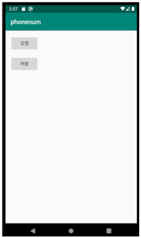

# 🔍 Address_Book

**Address_Book**은 DB에 저장되어있는 정보를 휴대폰 주소록에 자동으로 등록, 수정 해주는 어플입니다.

## 🖥️ 프로젝트 개요

- 🧩 **개발 환경**: Android Studio
- 🛠️ **구현 방식**: PHP사이트에서 엑셀 업로드 후 어플에서 저장
- 🗃️ **데이터베이스**: MySQL
- 🎯 **주요 기능**:
  - 주소록 자동 저장 및 수정 기능
  - 사이트에서 엑셀 업로드 후 DB저장 기능

---

## ⚙️ 기술 스택

| 구성 요소      | 사용 기술                |
|----------------|--------------------------|
| 백엔드         | PHP                     |
| 프론트엔드     | HTML                     |
| 서버           | Apache(XAPMM)            |
| 데이터베이스    | MySQL                    |

---

## 🚩 실행 시 꼭 읽어주세요!
1. **XAMPP 설치**
- [XAMPP 공식 사이트](https://www.apachefriends.org/index.html)

3. **프로젝트 파일 복사**
- php, html 파일을 `htdocs` 디렉터리에 복사합니다.
- php, html 파일 이름을 보기 쉽게 바꿔주세요.    ex)  C:/xampp/htdocs/phone

5. **MySql 데이터베이스 설정**
- XAMPP Control Panel에서 Apache 실행 
- 테이블을 미리 생성해주셔여 합니다.

4. **사이트 접속**
- upload.html에 접속해 파일을 업로드 합니다.

5. **주의 사항!!**
- 엑셀파일 .xlsx가 아닌 .csv로 확장자 명을 바꿔서 업로드 해야합니다.
- .csv 변경시 전화번호가 깨질경우 사이트내에서 자동으로 바뀌게 했으니 무시하셔도 됩니다.
- 한글이 깨질시 메모장으로 열고 UTF-8로 변경해야합니다.
## 🌄 화면 미리보기

Food_Find의 주요 화면들을 아래에서 확인하실 수 있습니다.

<table>
  <tr>
    <td align="center"><b>🏠 어플 메인 화면</b></td>
  </tr>
  <tr>
    <td></td>
  </tr>
    <tr>
    <td align="center"><b>📱 저장후 주소록 화면</b></td>
  </tr>
  <tr>
    <td></td>
  </tr>
  <tr>
    <td align="center"><b>📄 저장 순서</b></td>
  </tr>
  <tr>
    <td></td>
  </tr>

</table>

---

## 📌 향후 개선 방향

- 어플 디자인
- DB 및 테이블을 초기 스크립트를 실행해 자동으로 테이블 생성되도록 수정

---

## 📮 문의
더 좋은 아이디어 추천 받습니다!
- 개발자: **김보현**  
- 이메일: `qhgus9346@gmail.com`

